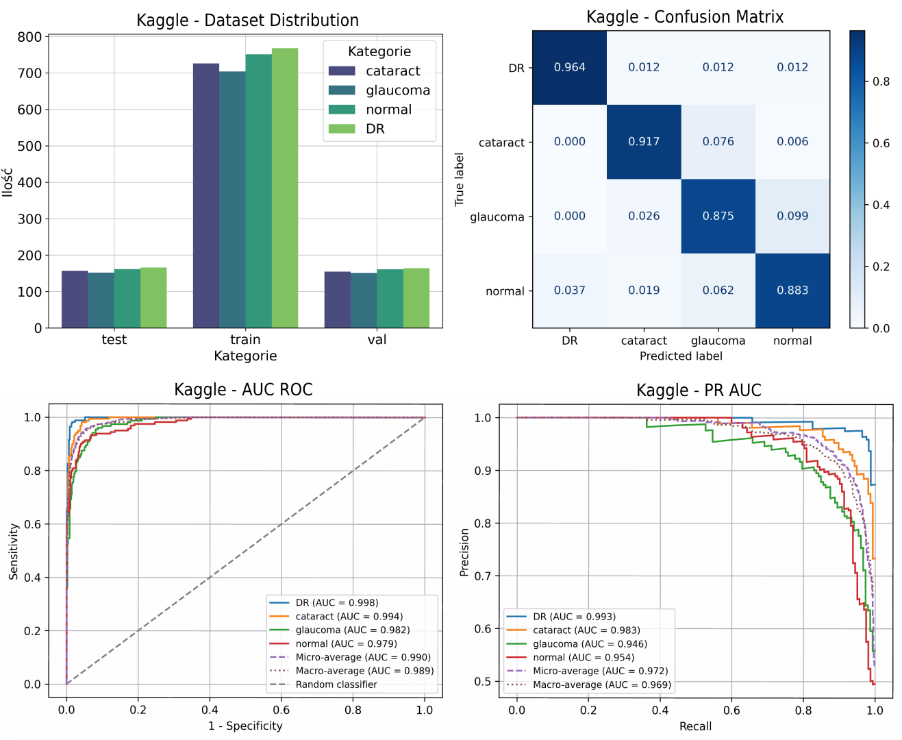

## Automated Detection of Systemic and Ophthalmic Pathologies Using RETFound in Fundus Imaging

This repository contains the implementation and research materials for a scientific-practical study employing deep learning methods to analyze retinal fundus images for automated diagnosis of systemic (hypertension, diabetes) and ophthalmic (cataracts, glaucoma, diabetic retinopathy, and age-related macular degeneration) diseases. Utilizing the advanced RETFound model, this interdisciplinary project enables comprehensive detection of various systemic and ocular diseases through color fundus image interpretation.

### 📝Key Features

- **Interdisciplinary approach**: Combining medical knowledge with advanced IT solutions for intelligent diagnostics.
- **Multi-disease detection**: Identifies systemic and ophthalmic diseases from CFI.
- **State-of-the-art technologies**: Powered by the RETFound model, designed for medical image analysis.
- **Diverse datasets**: Utilization of both private clinical, ensuring real-world applicability of the model, and public datasets.
- **Transfer learning**: Fine-tuning techniques applied to enhance generalizability and diagnostic accuracy across diverse datasets.

### 🗂Dataset Information

**Private Dataset** (developed with support from the [Medical University of Białystok](https://www.umb.edu.pl/en/index.php))
The dataset contains 21,410 fundus images from 3,214 patients. Based on biomarkers, images were categorized into the following disease groups:
- hypertansion (n=12911)
- diabetes (n=2863)
- cataract (n=2206)
- glaucoma (n=745)

**Public Datasets**
- [Kaggle](https://www.kaggle.com/datasets/gunavenkatdoddi/eye-diseases-classification/data)  
- [REFUGE2](https://refuge.grand-challenge.org/) (Retinal Fundus Glaucoma Challenge)
- [ADAM](https://amd.grand-challenge.org/) (Automatic Detection challenge on Age-related Macular degeneration)

All datasets were split into 70% training, 15% validation, and 15% test sets. 

### 📏Results 

The RETFound model demonstrated strong performance across all datasets, particularly on **public** benchmarks:

| Dataset      |  AUC  | Accuracy |
| ---          | ---   | ---      |
| Hypertension | 0.788 |   0.718  |
| Diabetes     | 0.813 |   0.739  |
| Glaucoma     | 0.856 |   0.777  |
| Cataracts    | 0.945 |   0.864  |
| Kaggle       | 0.990 |   0.947  |
| REFUGE2      | 0.976 |   0.947  |
| ADAM         | 0.976 |   0.945  |

### 📊Visualization

For each dataset, visualizations were created including confusion matrices, AUC-ROC curves, PR-AUC graphs, and distribution diagrams. You can view them [here](https://github.com/s20488/RETFound-multidisease-eye-screening/tree/main/documents).

An example from the *Kaggle* dataset is shown below:

  

### 📍Citation

@article{zhou2023foundation,
  title={A foundation model for generalizable disease detection from retinal images},
  author={Zhou, Yukun and Chia, Mark A and Wagner, Siegfried K and Ayhan, Murat S and Williamson, Dominic J and Struyven, Robbert R and Liu, Timing and Xu, Moucheng and Lozano, Mateo G and Woodward-Court, Peter and others},
  journal={Nature},
  volume={622},
  number={7981},
  pages={156--163},
  year={2023},
  publisher={Nature Publishing Group UK London}
}